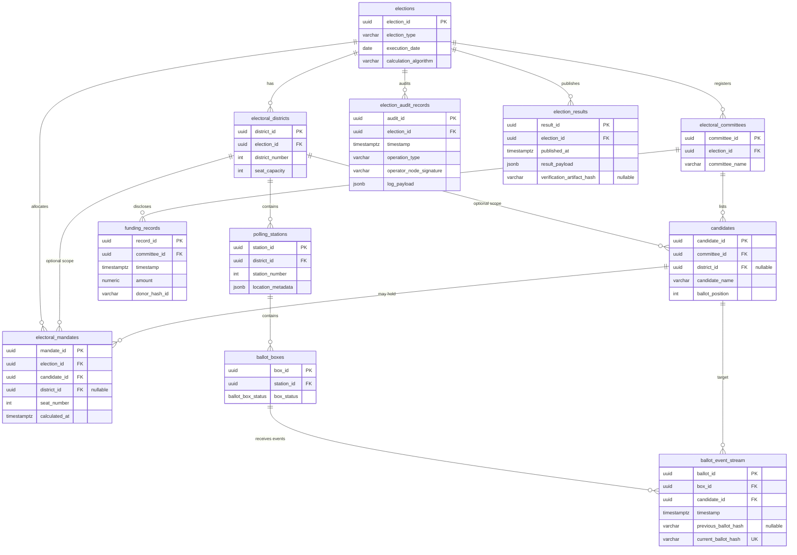

# Electoral domain model

**Technical layer · maps entities → PostgreSQL tables (`005_electoral_domain.sql`)**

Normative proposals: [`MANIFEST_DRAFT.md`](./MANIFEST_DRAFT.md)  
Architecture flow: [`ARCHITECTURE.md`](./ARCHITECTURE.md)  
COP identity: [`COP_LENS.md`](./COP_LENS.md)

Migration: [`backend/sql/005_electoral_domain.sql`](../../backend/sql/005_electoral_domain.sql)

Lab-only predecessor (deprecated for new work): [`backend/sql/004_electoral_protocol.sql`](../../backend/sql/004_electoral_protocol.sql)

---

## Entity relationship diagram



---

## Entity → table map

| Domain entity | PostgreSQL table | Notes |
|---------------|------------------|-------|
| Election | `elections` | Root aggregate; `calculation_algorithm` is a technical parameter per row |
| District | `electoral_districts` | `district_number` unique per election |
| PollingStation | `polling_stations` | `location_metadata` JSONB — codes/coordinates, not voter address book |
| Committee | `electoral_committees` | Registration metadata; no subscriber PII |
| FundingRecord | `funding_records` | `donor_hash_id` only — no raw donor identity |
| Candidate | `candidates` | `district_id` nullable for national lists |
| BallotBox | `ballot_boxes` | `box_status` enum: SEALED → CLOSED |
| Ballot (event) | `ballot_event_stream` | Append-only hash chain; **not** a voter row |
| AuditRecord | `election_audit_records` | `operation_type` + `log_payload` |
| Mandate | `electoral_mandates` | Seat allocation outcome |
| Result | `election_results` | Published aggregate payload + optional verification hash |

---

## Domain tree

```
Election (elections)
├── Committee (electoral_committees) ─── FundingRecord (funding_records)
├── District (electoral_districts)
│    └── PollingStation (polling_stations)
│         └── BallotBox (ballot_boxes)
│              └── Ballot event (ballot_event_stream)
├── Candidate (candidates)
├── Mandate (electoral_mandates)
├── AuditRecord (election_audit_records)
└── Result (election_results)
```

---

## Zero-PII on ballot stream and funding

Forbidden on `ballot_event_stream`, `funding_records`, and related ingest:

- Voter name, national ID, address, contact
- Raw donor identity (use `donor_hash_id` only)
- Observer / operator personal identity in stream rows
- Client IP, session ID, device fingerprint
- Free-text fields tied to a natural person

Allowed:

- `previous_ballot_hash`, `current_ballot_hash` (opaque; model-dependent)
- `candidate_id`, `box_id`, `timestamp`
- `donor_hash_id` (64-char hex digest — crypto model defined outside SQL)
- `location_metadata` as structured codes (not residential address book)

---

## Single-district / national mode

When an election has one logical district or no district rows:

- `candidates.district_id` and `electoral_mandates.district_id` remain **NULL**
- Seat uniqueness enforced via partial index on `(election_id, seat_number)` where `district_id IS NULL`

---

## Future extensions (not in 005)

- Ballot **template** table (valid marks per election)
- Recount snapshot tables
- Commission signature objects as first-class artifacts
- Staged publication flags on `election_results`
- Bridge views from `004` lab tables to `005` domain (explicit migration only)

Document here before adding migrations ≥ `006`.
